## **An example of Normalizing flows for Gravity inversion**

** This is python code repository with examples of Gravity Anomaly problem.

** The flows include: planar flow,  coupling flows,  autoregressive flows.

** The coupling functions include: Affine function, Invertible Neural Networks, Rational quadratic Spline.

** Also, MCMC code is shown for comparison.

** The following papers can be read for the basic  principles of Normalizing flows.

#### References:

** Rezende D, Mohamed S. Variational inference with normalizing flows. International conference on machine learning 2015 Jun 1 (pp. 1530-1538). PMLR.

 ** Kobyzev I, Prince SJ, Brubaker MA. Normalizing flows: An introduction and review of current methods. IEEE transactions on pattern analysis and machine intelligence.  2020 May 7;43(11):3964-79.
** Zhao X, Curtis A, Zhang X. Bayesian seismic tomography using normalizing flows. Geophysical Journal International. 2022 Jan;228(1):213-39.

** Contact: xingdaj@mun.ca  or jiangxdmun@gmail.cn
** Date   : 13 Jun, 2025

## The Forward Formula for Gravity Anomaly

$$
\begin{aligned}
\Delta g(x) = \frac{G \cdot \Delta \rho \cdot \left(\frac{4}{3}\pi R^3\right) \cdot z}{(z^2 + (x - x_0)^2)^{3/2}} \times 10^8
\end{aligned}
$$

#### Parameters:

| Symbol               | Description                   | Units            | Typical Value                  |
| :------------------- | ----------------------------- | ---------------- | ------------------------------ |
| $$ \\Delta g(x) $$ | Gravity anomaly at position x | µGal            | -                              |
| G                | Gravitational constant        | m³ kg⁻¹ s⁻² | $\(6.674 \times 10^{-11}\)$$ |
| $$ \Delta \rho $$ | Density contrast              | kg/m³           | 2500                           |
| R                | Sphere radius                 | m                | -                              |
| z                | Depth of sphere center        | m                | -                              |
| $$ x_0 $$      | Horizontal position of sphere | m                | -                              |
| x                | Observation position          | m                | -                              |

In our problem, the gravity anomaly is caused by a 2D circle density anomaly. (x_0, z, R) are three unknown model parameters while the others keep fixed. We provide seven independent python code packages for comparison.

## Code package theory

**  Gravity_MCMC.py :  Metropolis-Hastings (MH) MCMC sample.

** Gravity_planar.py: Planar flow.

** Gravity_auto_Affine.py: Autoregressive flow with Affine coupling function.

** Gravity_auto_NSF.py: Autoregressive flow with Neural Spline Function.

** Gravity_coupling_Affine.py: Coupling flow with Affine function.

** Gravity_coupling_NSF.py: Coupling flow with Neural Spline Function.

** Gravity_invertible_Affine.py : Invertible convolution flow with Affine function.

## MCMC result

We totally conduct 100000 + 20000 (burn-in) iterations for comparison with different posterior distributions. Here is the result.

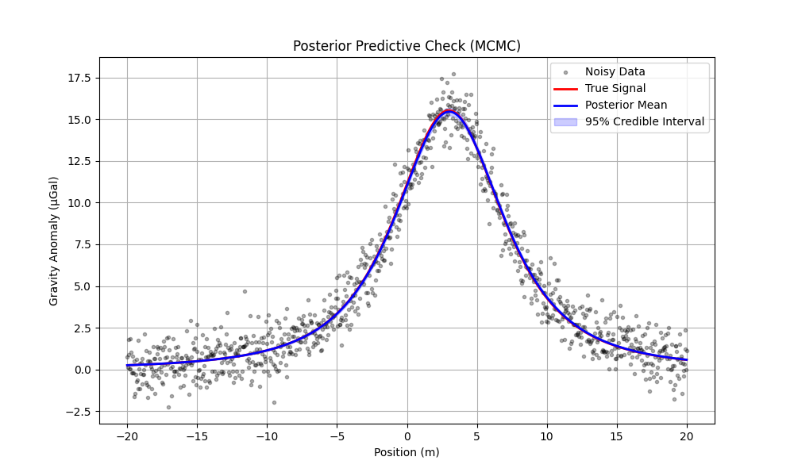

## Influence factor

The following factors have some influence on the final results:

1. Flow species

2. Coupling functions

3. Number of iterations

4. Number of flows

5. Gradient

   #### Flow species

   Usually, the Coupling flows and Autoregressive flows are more flexible than Planar flow. That means the Coupling/Autoregressive flows may have better results than Planar flow, while Planar flow is for some special cases. However, the planar result is no obviously better than others as this is a simple example.  

   (1) Planar result

   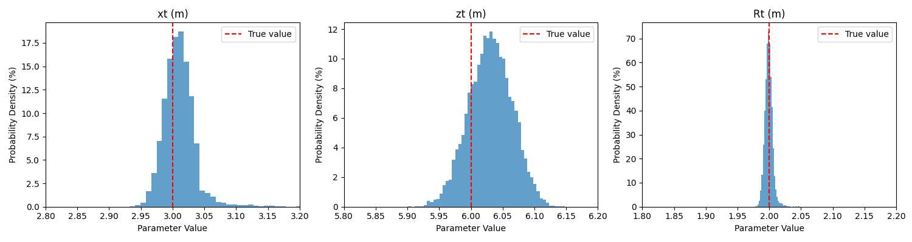

   (2) Coupling flows with NSF

   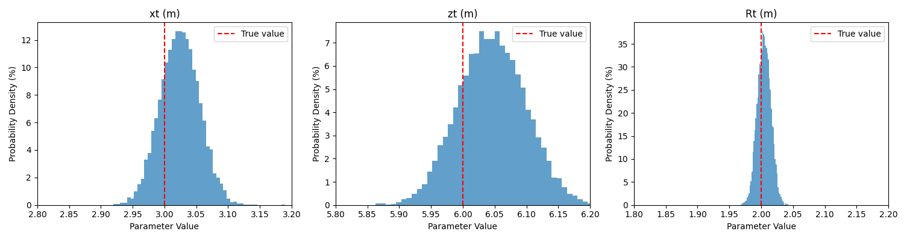

​     (3) Autoregressive flows with NSF

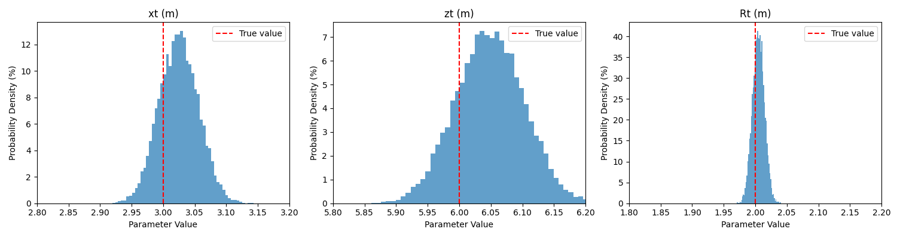    

#### Coupling functions/Number of iterations 

In Coupling/Autoregressive flows, the Affine function is usually adopted, however, the Spline Function is much more flexible and easy for correct posterior inference. So the Affine function may need more time to get the final result. But, 'Flexible' means 'Complicated'. We should keep the balance between accuracy and efficiency.

(1) Coupling flows with Affine function (2000 iterations)

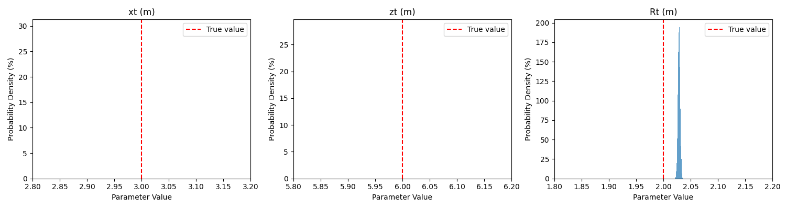

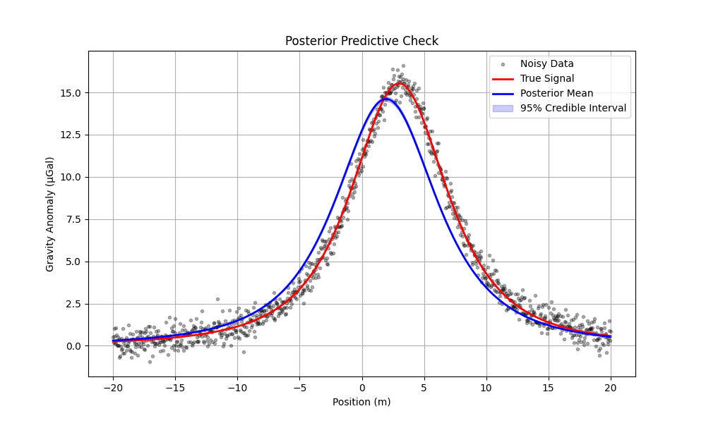

(2) Coupling flows with Affine function (5000 iterations)

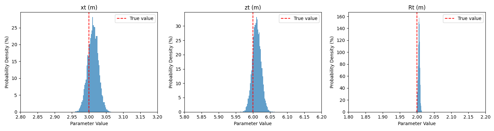

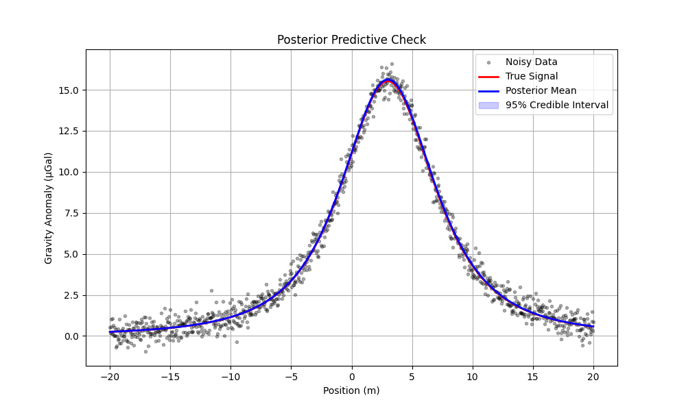

(3) Coupling flows with NSF (1500 iterations)

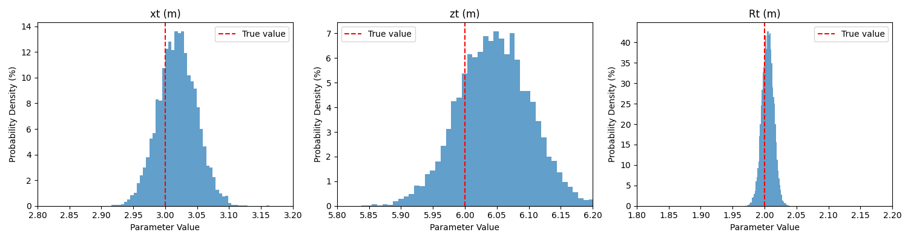

#### Number of flows

The number of flows also have a large influence on the final result. More number of flows means more flexible, however, it needs more time to train the factors.  Also, increasing the number of flows sometimes does not improve the accuracy when it reaches a certain level. It should keep the balance between the number and the time. 

(1) Planar flow with flow number = 2

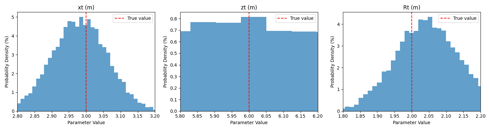

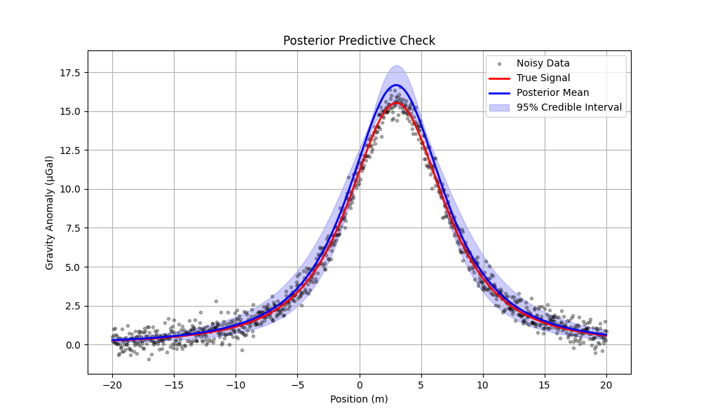

(2) Planar flow with flow number  = 20

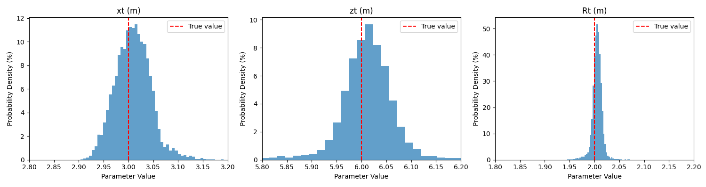

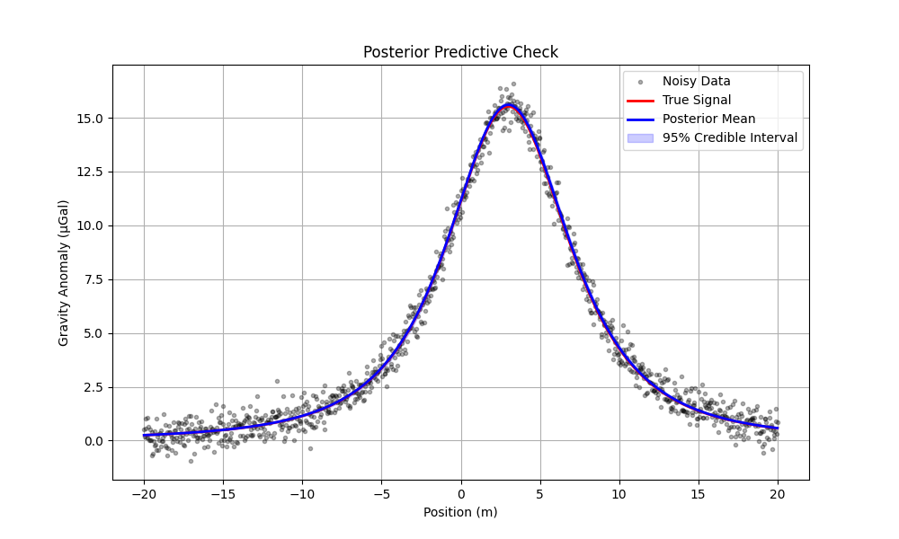

### Gradient

We need to calculate the gradients when updating the weighting factors in flow functions. However, the calculated gradients can't be directly applied in case of introducing  dramatic change. Often, the calculated ones should be clipped into a reasonable range. That definite range have a significant impact on the outcomes. Thus, the clipped gradients should be carefully checked, and it may result in different levels of accuracy. 

(1) Coupling flows with Affine function (5000 iterations,  -10.0<gradient<10.0) 

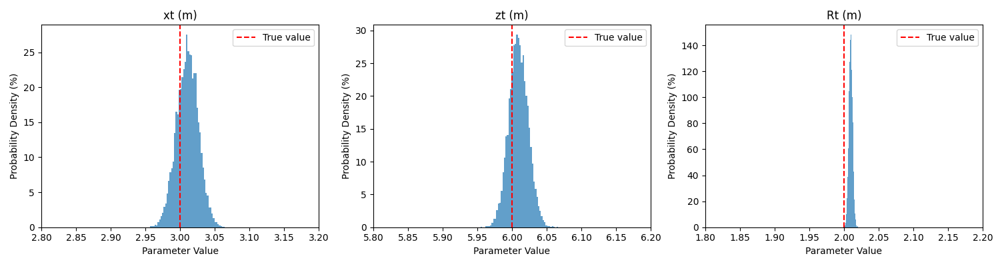

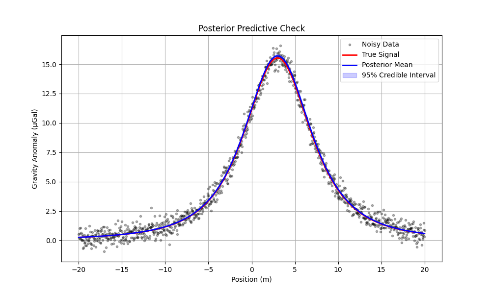

(2) Coupling flows with Affine function (5000 iterations,  -0.1<gradient<0.1) 

## Conclusion

During the actual coding process, the above factors (also with other) together influences the final result. You should keep trying to find the best parameters. But, remember that, we want to find an available normalizing flow to take place the MCMC. Thus, the cost time should be considered.  
